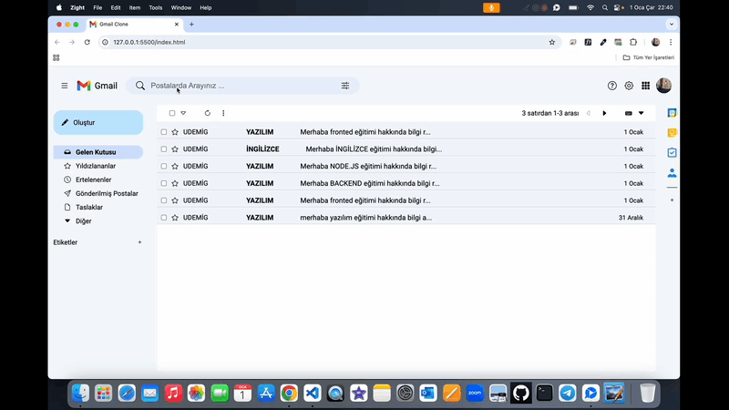

# Gmail Clone 🚀

<li>Bu proje HTML5,SCSS,JS ile oluşturulmuş Github Clone kullanıcı profili site arayüzü içerir.</li>
<li>Projede mail oluşturma,silme,filtreleme,yıldızlama,arama yapma gibi Javascript'in temel özelliklerini uygulandı.</li>
<li>SCSS ile modüller oluşturularak proje yönetimi kolaylaştırılmıştır. </li>

# Kullanılan Teknolojiler 🎨

<li>HTML5</li>
<li>SCSS</li>
<li>JSS</li>

# Ekran Görüntüsü 🎥
      

# İletişim 📩
yunusemreoral@hotmail.com.tr
